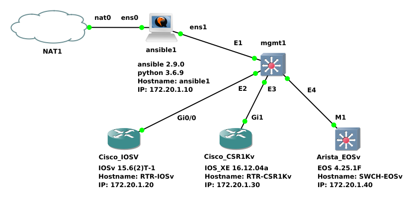

## net_cfg_check
### Verification and Reporting of Network Configuration Compliance

Inspired by Nicholas Leiva (https://github.com/nleiva/ansible-networking/blob/master/ntp-compliance.yml)

# Network Diagram

### Changed direction on the approach
- 1. Testing Ansible cli_parse with command and text parameters

pb_config_parse_exmpl.yml > from Ansible Documentation ansible.utils.cli_parse. Changed command to 'show interface' and set template path.
Template was modified to match CSR output.

pb_config_parse_text.yml > copy of pb_config_parse_exmpl.yml, changed from command to text to parse a file.

